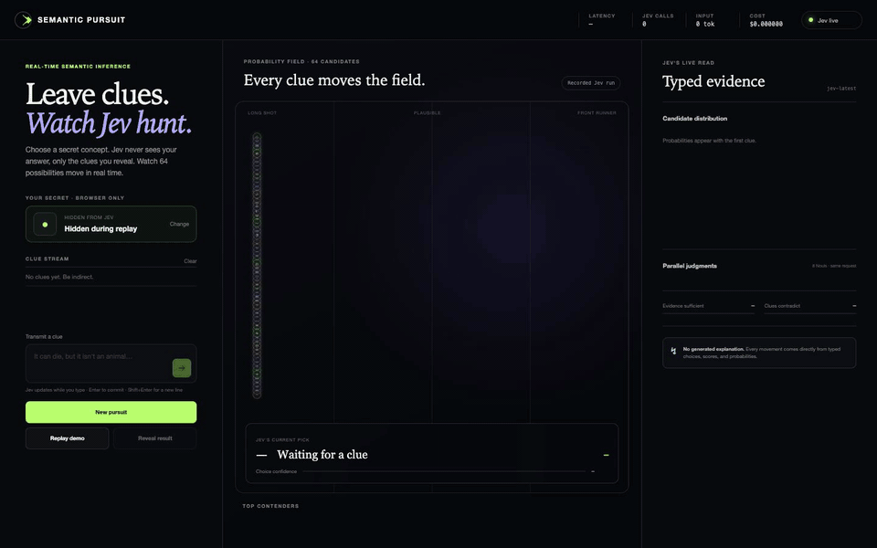

# Semantic Pursuit

A real-time hidden-concept race powered by [TypeSafe Jev](https://typesafe.ai).

You secretly pick one of 64 concepts. You describe it with clues but never name it.
Jev sees only the clue history, and after every update the interface animates the
entire candidate field: probabilities, confidence, nine parallel semantic judgments,
and an evidence-sufficiency verdict.



The clip shows a recorded Jev run (41% → 100% across four clues), then a live round
where probabilities shift while the clue is still being typed.

## Why this demonstrates Jev

- **Intelligence is verifiable.** You know the hidden answer; Jev does not. Every
  probability move is checkable against ground truth you already hold.
- **Context accumulates.** Later clues reinforce, negate, or reframe earlier ones,
  and the field reorders accordingly.
- **Speed is visible.** Latency, call count, tokens, and cost stay pinned in the
  header. Typical evaluations land in 110–260 ms.
- **Uncertainty is visible.** The UI shows the full probability distribution and
  per-candidate deltas, not just the winning label.
- **One request does more.** A candidate Choice over 64 ids, a family Choice, nine
  Nouls, and a sufficiency Score are batched into a single Jev call.
- **Code stays in control.** Jev returns typed judgments. The application owns the
  race, the reveal, the telemetry, and all presentation.

## How it works

```
browser                            node server                      TypeSafe
───────                            ───────────                      ────────
clue history + draft  ──POST──▶  normalize + cache key
(hidden target never sent)       │
                                 ├─ cache hit ──▶ cloned snapshot
                                 │
                                 └─ miss ──▶ client.systemOne() ──▶ jev-latest
                                                                      │
typed PursuitSnapshot  ◀──JSON──  reshape answers  ◀───────────────────┘
```

Each evaluation sends one `systemOne` request containing:

| Question | Type | Purpose |
| --- | --- | --- |
| `candidate` | Choice over 64 ids | Which concept fits all clues together |
| `family` | Choice over 8 labels | Which broad family the thing belongs to |
| `living`, `manufactured`, `portable`, `indoor`, `edible`, `electronic`, `place`, `creature` | Noul | Parallel semantic attributes of the described thing |
| `contradiction` | Noul | Whether the clues materially conflict |
| `sufficiency` | Score over 5 levels | How decisively the clues identify one candidate |

The response is reshaped into a typed `PursuitSnapshot` carrying the full candidate
and family distributions, all nine signals, latency, token usage, and estimated cost.

### Cost and rate controls

- Clue input is debounced at 450 ms, and requests are capped at one per 500 ms.
- Identical clue states are cached, so a draft that is committed unchanged is a
  cache hit rather than a second call.
- Stale in-flight responses are discarded by a monotonic `RequestGate`.
- Requests are validated server-side: at most 10 clues, 180 characters each,
  1,200 characters total.
- Cost is estimated at $0.042 per 1M input tokens, with output tokens free. A full
  four-clue round costs roughly $0.0004.

### Security model

- The TypeSafe API key lives only in the server process and is read from `.env`.
  It is never sent to the browser.
- The hidden target stays in browser memory. The request body carries only the clue
  history, an optional draft, and a request id.
- `/api/pursuit/evaluate` returns 503 when no key is configured, and the UI shows a
  blocking setup state instead of silently degrading.

## Run it

Requires Node.js 20 or newer and a TypeSafe API key from
[console.typesafe.ai/keys](https://console.typesafe.ai/keys).

```bash
npm install
cp .env.example .env
# Add TYPESAFE_API_KEY to .env
npm run dev
```

Open [http://127.0.0.1:5173](http://127.0.0.1:5173).

For a production build:

```bash
npm run build
npm start
```

Then open [http://127.0.0.1:8787](http://127.0.0.1:8787).

## Recorded autoplay

The opening sequence replays committed responses from a real Jev run and is clearly
labeled **Recorded Jev run**, so the demo works before a key is added and never
misrepresents live inference. Regenerate it after changing the catalog or questions:

```bash
npm run fixtures
```

This makes four live Jev calls and writes `public/autoplay-houseplant.json`,
reporting exact input tokens, latency, and estimated cost.

## Project structure

```
index.html                  Three-column shell: clues · race · evidence
src/main.ts                 Round state machine, debounce, telemetry, reveal
src/race.ts                 64-runner probability race renderer
src/catalog.ts              64 candidates across 8 families
src/types.ts                Shared snapshot, request, and fixture types
src/request-gate.ts         Monotonic request sequencing
src/style.css               Dark editorial theme
server/index.ts             Static hosting plus /api/status and /api/pursuit/evaluate
server/pursuit.ts           Jev questions, validation, caching, pricing
server/pursuit.test.ts      Validation, cache, cost, and sequencing tests
scripts/generate-fixtures.ts  Records the autoplay sequence from live Jev
public/autoplay-houseplant.json  Recorded four-clue run
```

## Commands

```bash
npm run dev       # API and Vite development servers
npm run build     # Type-check and create the production build
npm start         # Serve the production build and API
npm test          # Validation, cache, cost, and sequencing tests
npm run fixtures  # Record the autoplay sequence from live Jev responses
```

## Built with

TypeScript, Vite, a dependency-free Node HTTP server, Vitest, and the
[`@typesafe-ai/sdk`](https://www.npmjs.com/package/@typesafe-ai/sdk).
